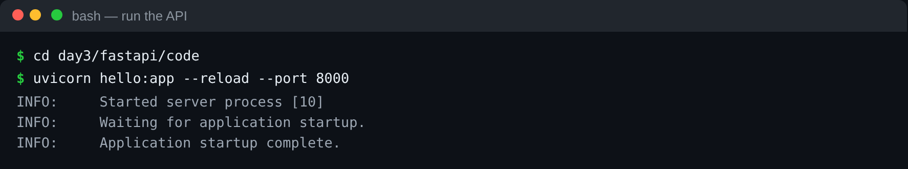
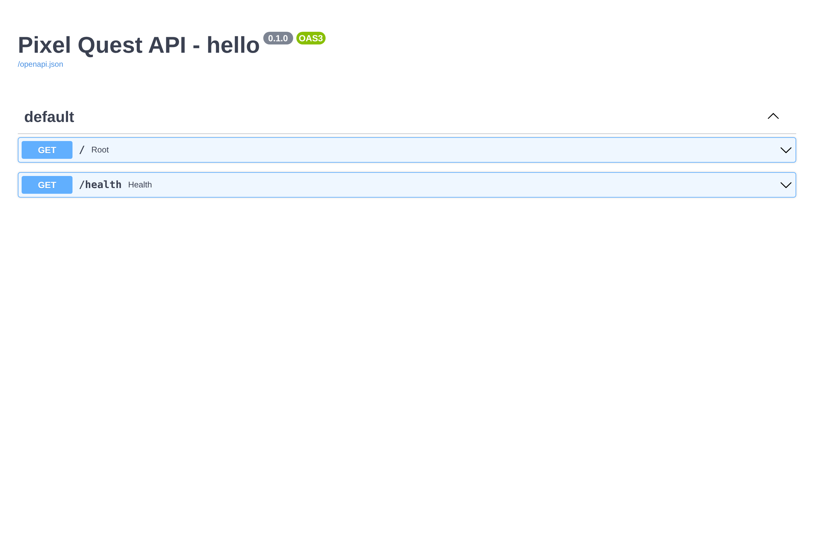
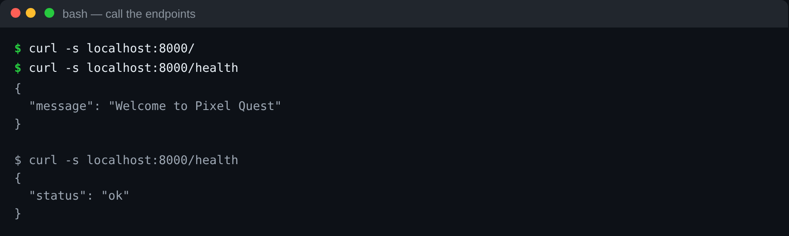

# FastAPI — Step 1: What it is, and your first API

## What is an API?

An **API** (Application Programming Interface) is a **front door** to your system. Instead of letting people touch the database directly, you expose a set of **HTTP endpoints** — URLs like `GET /players` or `POST /players` — that other programs and web pages call to read and write data.

A **web API** speaks HTTP:
- a **method** (GET = read, POST = create, PUT = update, DELETE = remove),
- a **path** (`/players/1`),
- and usually **JSON** in and out.

## What is FastAPI?

**FastAPI** is a modern Python framework for building web APIs. People like it because it is:
- **Fast to write** — an endpoint is just a Python function with a decorator.
- **Typed** — you describe data with Python type hints / Pydantic, and FastAPI validates it for you.
- **Self-documenting** — it generates interactive API docs automatically at `/docs`.
- **Async-ready** — it handles many requests at once (we use this in lesson 3).

We run it with **uvicorn**, a lightweight web server.

---

## Your first API

The file [`code/hello.py`](code/hello.py):

```python
from fastapi import FastAPI

app = FastAPI(title="Pixel Quest API - hello")

@app.get("/")
def root():
    return {"message": "Welcome to Pixel Quest"}

@app.get("/health")
def health():
    return {"status": "ok"}
```

- `app = FastAPI(...)` creates the application.
- `@app.get("/")` says "when someone does a **GET** request to `/`, run this function".
- Returning a Python dict → FastAPI sends it back as **JSON** automatically.

## Run it

uvicorn loads the app by importing the file, so we `cd` into the folder and run by filename:

```bash
cd day3/fastapi/code
uvicorn hello:app --reload --port 8000
```

- `hello:app` = "in `hello.py`, use the variable `app`".
- `--reload` = restart automatically when you edit the file.



## Try it

- Open **http://localhost:8000/** → `{"message":"Welcome to Pixel Quest"}`.
- Open **http://localhost:8000/health** → `{"status":"ok"}`.
- Open **http://localhost:8000/docs** → the **interactive documentation**. FastAPI built this from your code. Click an endpoint, press **Try it out → Execute**, and it calls your API live.




Or call the same endpoints from the terminal with `curl`:



> The `/docs` page is one of FastAPI's best features: free, always-up-to-date API documentation that you and other teams can actually use.

## How a request flows

```
 browser ──GET /health──► uvicorn ──► FastAPI ──► your health() function ──► {"status":"ok"} ──► browser
```

That is the whole idea of an API: a request comes in, a function runs, a response goes out.

➡️ Next: **[02-pydantic-and-endpoints.md](02-pydantic-and-endpoints.md)** — describe your data and add real endpoints.

---

## ⭐ Must-learn from this topic

- **What an API is** — HTTP methods (GET/POST/PUT/DELETE), paths, JSON.
- **`@app.get(...)`** — map a path to a Python function; return a dict → JSON.
- **uvicorn** — `uvicorn module:app --reload --port 8000`.
- **`/docs`** — automatic interactive API documentation.

### 📚 Official docs
- [FastAPI — First steps](https://fastapi.tiangolo.com/tutorial/first-steps/) — your first app.
- [FastAPI tutorial](https://fastapi.tiangolo.com/tutorial/) — the full guided path.
- [uvicorn](https://www.uvicorn.org/) — the ASGI server we run.
