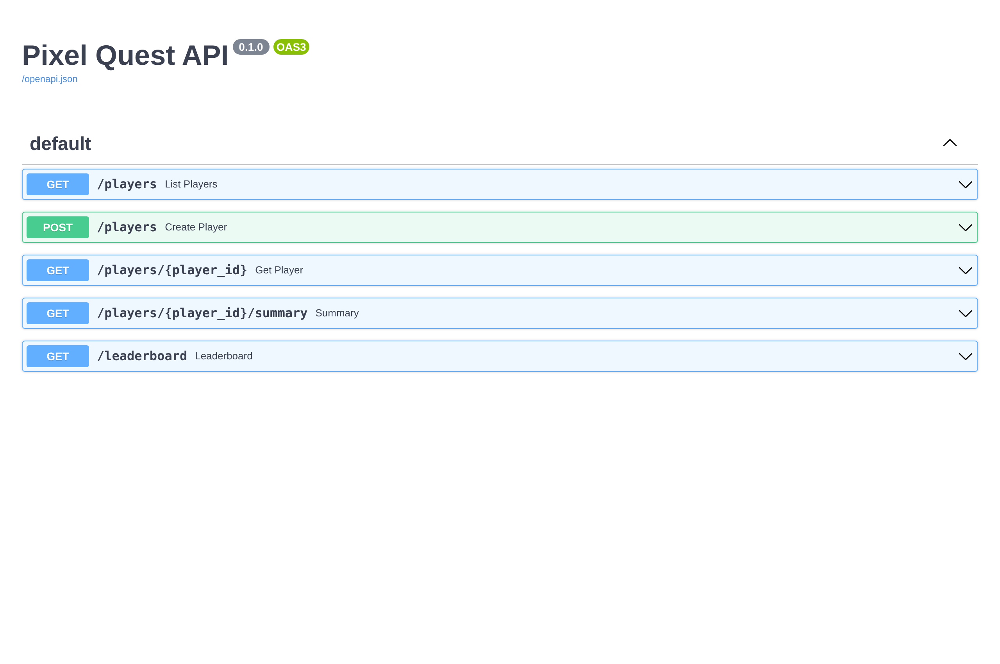
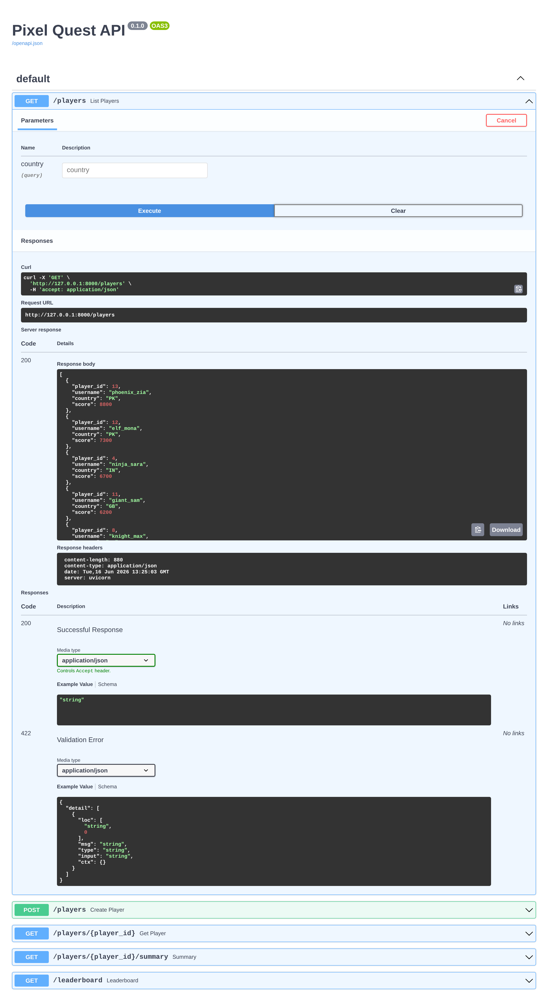
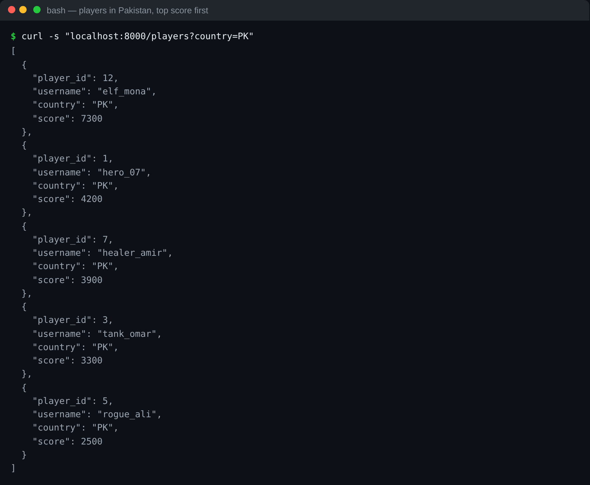
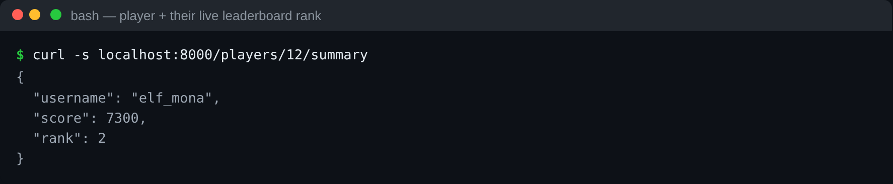
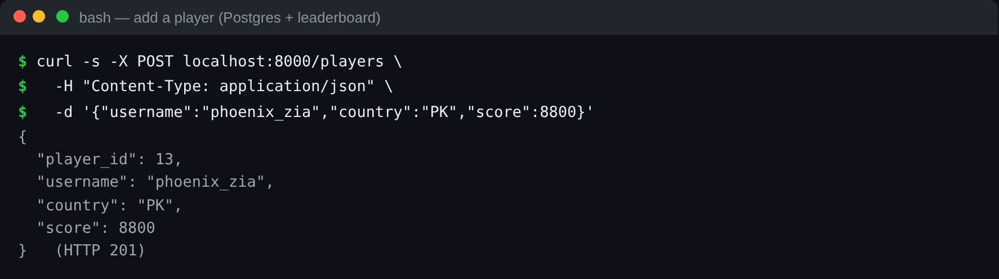

# FastAPI — Step 4: LAB (the Pixel Quest API)

Put it together: a complete async API over the Day 1 databases. The full app is [`code/app.py`](code/app.py).

Endpoints:

| Method & path | What it does |
|---------------|--------------|
| `GET /players` | list players (optional `?country=PK`) |
| `GET /players/{id}` | one player |
| `GET /players/{id}/summary` | player + leaderboard rank (concurrent reads) |
| `GET /leaderboard?top=5` | top N from the Redis leaderboard |
| `POST /players` | add a player (writes Postgres **and** the leaderboard) |

---

## Run it

```bash
cd day3/fastapi/code
uvicorn app:app --reload --port 8000
```

Open **http://localhost:8000/docs** and work through the endpoints.



Expand any endpoint, press **Try it out → Execute**, and Swagger calls it live (here, `GET /players`):



## Exercise it (so you have traffic for the observability lessons)

From another terminal, or from `/docs`:

```bash
# list
curl http://localhost:8000/players
curl "http://localhost:8000/players?country=PK"

# one player + a 404
curl http://localhost:8000/players/1
curl http://localhost:8000/players/999      # 404 with a message

# leaderboard + summary
curl "http://localhost:8000/leaderboard?top=5"
curl http://localhost:8000/players/1/summary

# create a player (then see it in the leaderboard)
curl -X POST http://localhost:8000/players \
  -H "Content-Type: application/json" \
  -d '{"username":"new_star","country":"PK","score":8000}'
curl "http://localhost:8000/leaderboard?top=5"
```

> `new_star` with 8000 should now be #1 on the leaderboard — the POST wrote to **both** PostgreSQL and Redis.

Filtering players by country from the terminal:



`GET /players/{id}/summary` — player plus leaderboard rank from concurrent reads:



Creating a player — the POST writes Postgres **and** the Redis leaderboard (201 Created):



---

## What you achieved

- A real **async API** over the Day 1 PostgreSQL and Redis.
- **Pydantic** validation, proper **status codes** (201, 404, 409), and free **/docs**.
- **Concurrent** reads with `asyncio.gather`.

This app is the thing we will **observe** in the next section — metrics, traces, and logs all describe requests to these endpoints.

### Deliverable for this track
Commit `app.py`. In your notes: *Why is `async def` the right choice for this API? Trace what happens, step by step, when a request hits `GET /players/1/summary`.*

➡️ Next: **[../observability/01-three-pillars.md](../observability/01-three-pillars.md)**

---

## ⭐ Must-learn from this topic

- **A complete API** — list/get/create + derived endpoints over real stores.
- **Writing to two stores** — POST updates Postgres and the Redis leaderboard.
- **Right status codes** — 201 created, 404 missing, 409 conflict.
- **This app is what we observe next** — metrics/traces/logs all describe it.

### 📚 Official docs
- [FastAPI tutorial](https://fastapi.tiangolo.com/tutorial/) — full reference for the patterns used.
- [Response model](https://fastapi.tiangolo.com/tutorial/response-model/) — shaping output.
- [Testing FastAPI](https://fastapi.tiangolo.com/tutorial/testing/) — a good next step.
