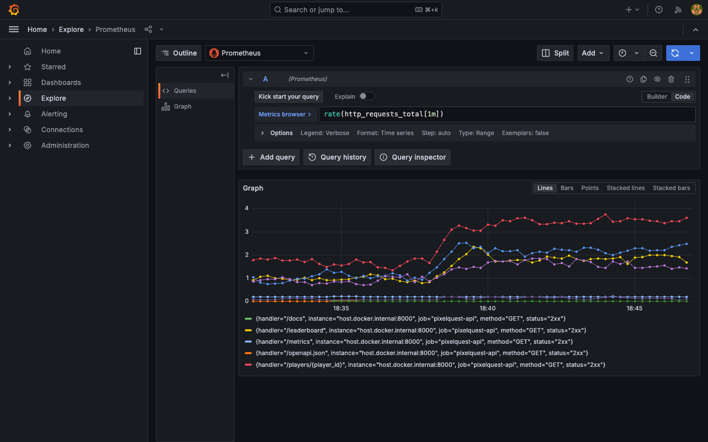
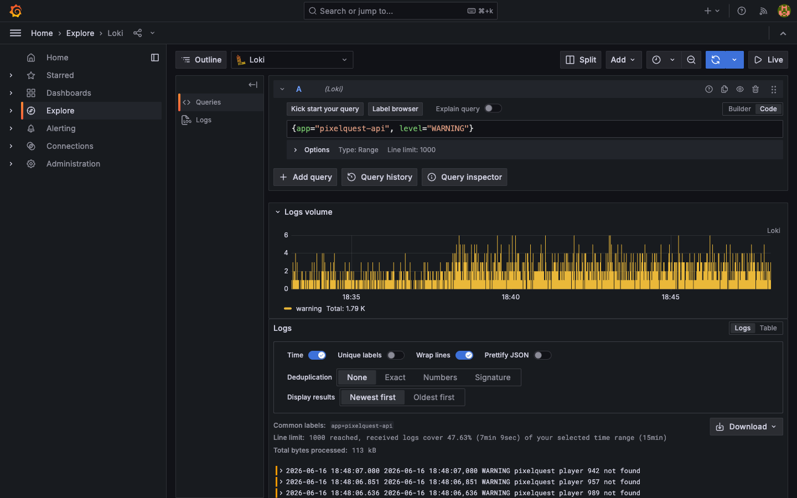
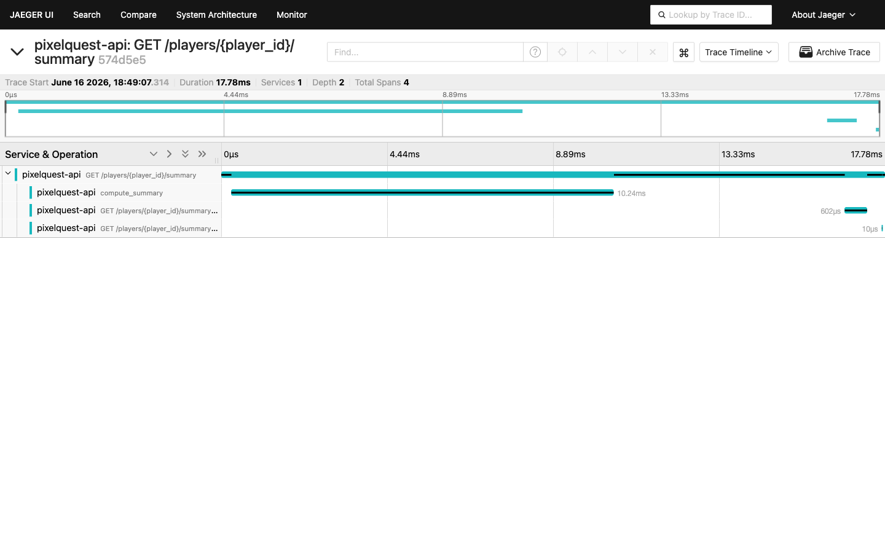

# Observability — Step 5: LAB (observe the API end to end)

Now use all three pillars **together**, the way you would in a real incident. You will generate traffic, then follow a single question from metrics → traces → logs.

---

## Step 1 — run the observed app and make traffic

```bash
# terminal 1: the fully-instrumented app
cd day3/observability/code
uvicorn app_observed:app --reload --port 8000

# terminal 2: steady traffic (includes deliberate 404s)
python day3/observability/code/load.py
```

Leave both running for a minute so there is data in every tool.

---

## Step 2 — METRICS: is anything wrong, and when? (Grafana + Prometheus)

Open Grafana **Explore** → **Prometheus**:

```promql
# request rate per endpoint
rate(http_requests_total[1m])

# error rate: 4xx/5xx responses per second
rate(http_requests_total{status=~"4xx|5xx"}[1m])
```

You should see a steady stream of 4xx — those are the `/players/9xx` requests that return 404. Metrics told you *"there are errors, and roughly how many."* Now find out *what* they are.



---

## Step 3 — LOGS: what exactly is failing? (Grafana + Loki)

Open Grafana **Explore** → **Loki**:

```logql
{app="pixelquest-api", level="WARNING"}
```

You will see lines like `WARNING player 953 not found`. Logs told you the **exact** events behind the error metric.



---

## Step 4 — TRACES: where does a request spend its time? (Jaeger)

Open **http://localhost:16686** → service **pixelquest-api** → **Find Traces** → open a `/players/{player_id}/summary` trace.

Expand the spans. You can see the request span, the **`compute_summary`** child span, and how long the work took. Traces told you **where the time went** inside one request.



---

## Step 5 — put the story together

You just practised the real debugging loop:

```
 Metrics (Grafana/Prometheus): "4xx errors are happening, ~2/sec since 14:05"
   │
   ▼
 Logs (Grafana/Loki):          "WARNING player 953 not found"  (the exact events)
   │
   ▼
 Traces (Jaeger):              "/summary spends most time in the Postgres span"
```

Each pillar answered a different question; together they explain the system.

---

## Bonus — see a custom metric move

Create players and watch your custom counter rise in Prometheus:

```bash
curl -X POST http://localhost:8000/players \
  -H "Content-Type: application/json" \
  -d '{"username":"obs_star","country":"PK","score":9000}'
```

In Prometheus/Grafana query: `pq_players_created_total` — it increments with each POST.

---

## What you achieved

- Instrumented a real API with **metrics, traces, and logs**.
- Used **Grafana, Prometheus, Jaeger, and Loki** together to answer "what, when, where, why".
- Added and observed a **custom metric**.

### Deliverable for this track
Commit `app_observed.py` and your notes: *Write the 3-step story (metrics → logs → traces) you would follow if users reported the API was slow. Which query did you run in each tool?*

➡️ Back to the day plan: **[../README.md](../README.md)**

---

## ⭐ Must-learn from this topic

- **The debugging loop** — metrics (what/when) → logs (what exactly) → traces (where).
- **Cross-tool fluency** — PromQL, LogQL, and reading a Jaeger trace.
- **Custom metrics** — watch `pq_players_created_total` move.
- **All three pillars** describe the same requests from different angles.

### 📚 Official docs
- [Grafana Explore](https://grafana.com/docs/grafana/latest/explore/) — query any data source.
- [OpenTelemetry observability primer](https://opentelemetry.io/docs/concepts/observability-primer/) — how the signals fit.
- [Prometheus querying examples](https://prometheus.io/docs/prometheus/latest/querying/examples/) — rate & error queries.
