# Day 4 screenshots — what's captured and where

Every Day 4 example has a screenshot embedded in its lesson, right after the
matching code/command. Images live in a per-topic `images/` folder next to the
lessons (not in this folder), so each lesson links them with `images/<file>`.
This page gathers them all in one place.

All browser shots were captured live from the running stack:

```bash
docker compose up -d                                     # Day 1 (Postgres)
cd day3/observability/code && uvicorn app_observed:app --port 8000   # Day 3 API (CORS on)
cd day4/app && npm run dev                               # React app  :5173
docker compose -f day4/docker-compose.day4.yml up -d     # Metabase   :3001
```

> The React shots were taken by mounting each lesson's component in `App.tsx`; the
> testing shots are styled renders of the real `npm test` output; the BI shots are
> from Metabase logged in at `localhost:3001`.

---

## 1. React + TypeScript — [`react/images/`](../react/images/)

| Lesson | Shot |
|--------|------|
| [01 — first component](../react/01-intro-and-first-component.md) | the `<Hello>` component in the browser |
| [02 — props, state, lists](../react/02-props-state-lists.md) | mapped list + `<Counter>` after 3 clicks |
| [03 — hooks & types](../react/03-hooks-and-types.md) | `useEffect` list fetched from the API |
| [04 — LAB leaderboard table](../react/04-lab-leaderboard-table.md) | top-3 **and** "Show all" (state toggle) |

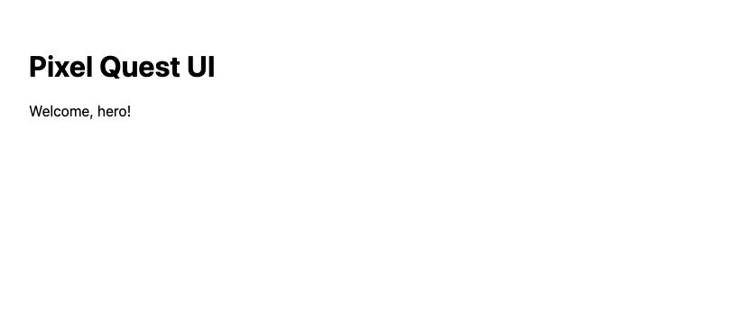
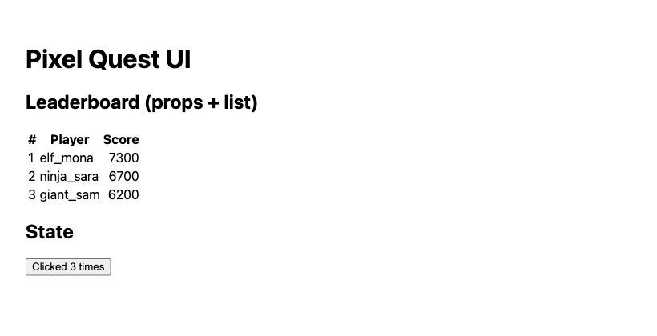
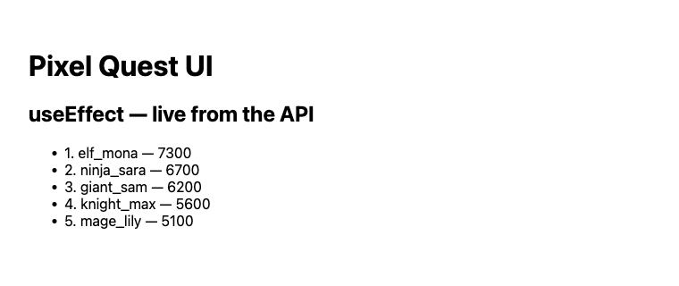

| Top 3 | Show all |
|---|---|
| 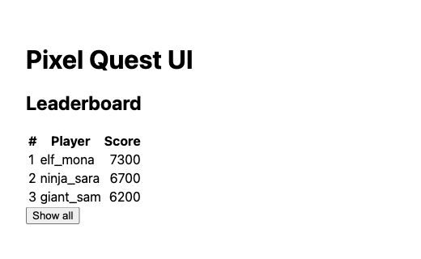 | 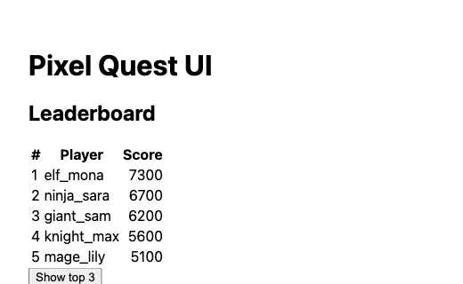 |

---

## 2. State & data fetching — [`state/images/`](../state/images/)

| Lesson | Shot |
|--------|------|
| [01 — Redux Toolkit](../state/01-redux-toolkit.md) | TopNPicker driving the table **(+ data-flow diagram)** |
| [02 — RTK Query](../state/02-rtk-query.md) | leaderboard from one hook **(+ cache-flow diagram)** |
| [03 — LAB live data](../state/03-lab-live-data.md) | live leaderboard + player detail |

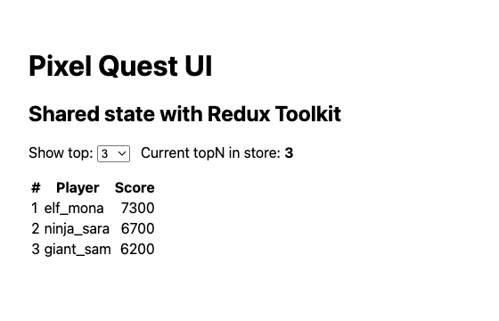
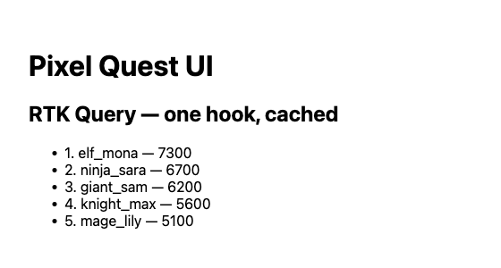
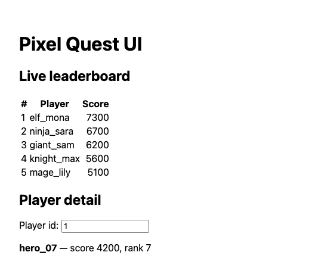

---

## 3. Graph view (Vis.js) — [`graphview/images/`](../graphview/images/)

| Lesson | Shot |
|--------|------|
| [01 — drawing a network](../graphview/01-vis-network.md) | a 3-node network |
| [02 — LAB friendships](../graphview/02-lab-friendships.md) | the full friendships network |

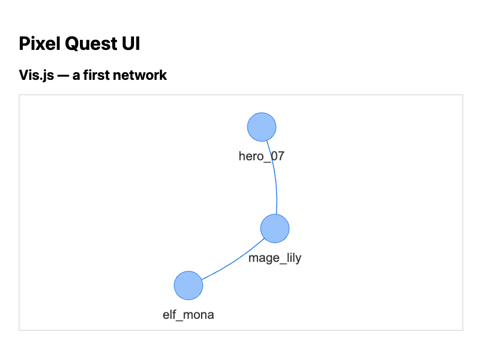
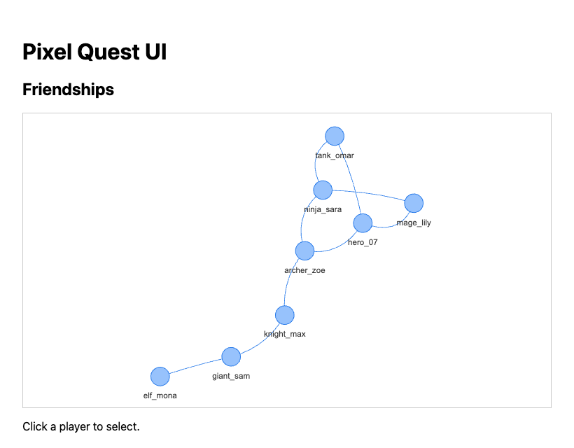

---

## 4. Testing (Vitest + RTL + MSW) — [`testing/images/`](../testing/images/)

Styled renders of the real `npm test` output.

| Lesson | Shot |
|--------|------|
| [01 — React Testing Library](../testing/01-jest-rtl.md) | 2 LeaderboardTable tests passing |
| [02 — LAB MSW](../testing/02-lab-msw.md) | all 4 tests passing **(+ MSW flow diagram)** |

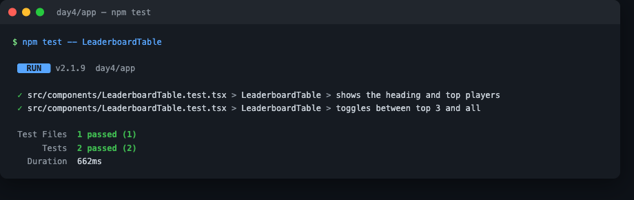
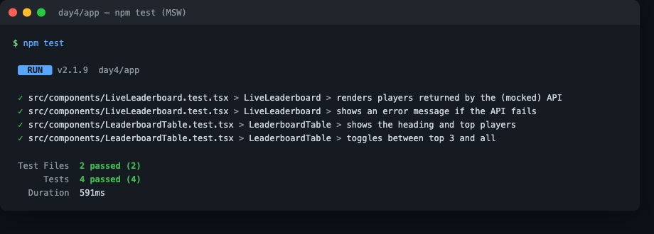

---

## 5. Business Intelligence (Metabase) — [`bi/images/`](../bi/images/)

Captured from Metabase at `localhost:3001`, connected to the Day 1 `pixelquest` database.

| Lesson | Shots |
|--------|-------|
| [01 — connect Metabase](../bi/01-connect-metabase.md) | connection form, browse tables, Players table |
| [02 — questions & visuals](../bi/02-questions-and-visuals.md) | bar (top players), line (coins), pie (players/country) |
| [03 — LAB dashboard](../bi/03-lab-dashboard.md) | the assembled dashboard **(+ architecture diagram)** |

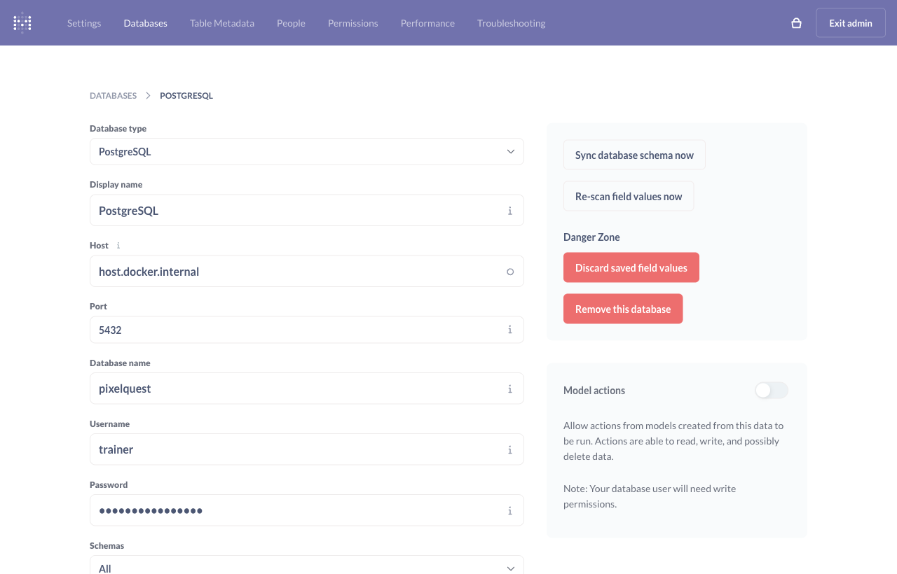
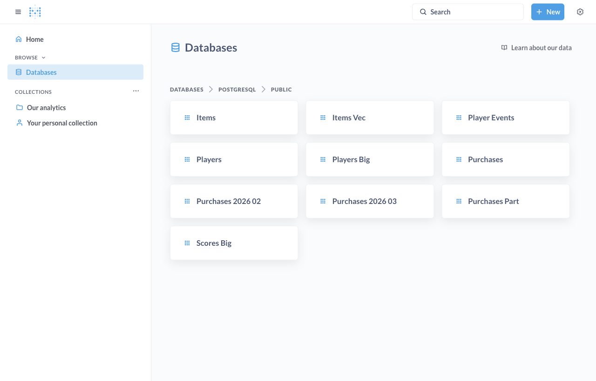
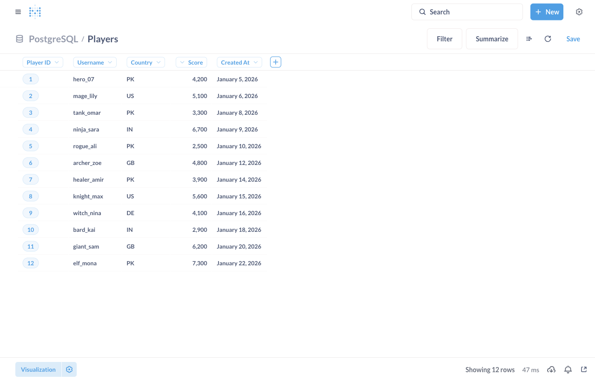
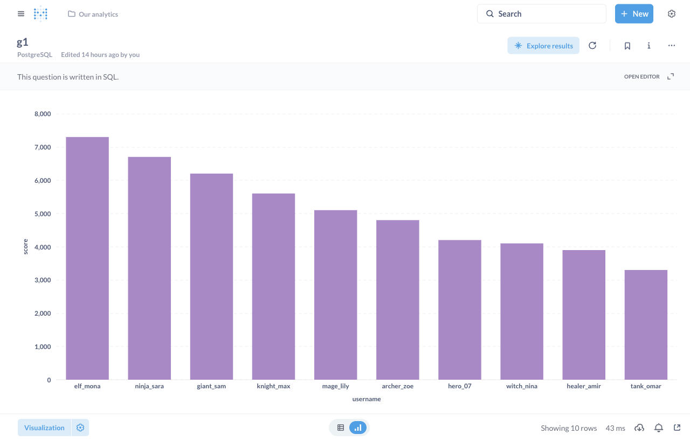
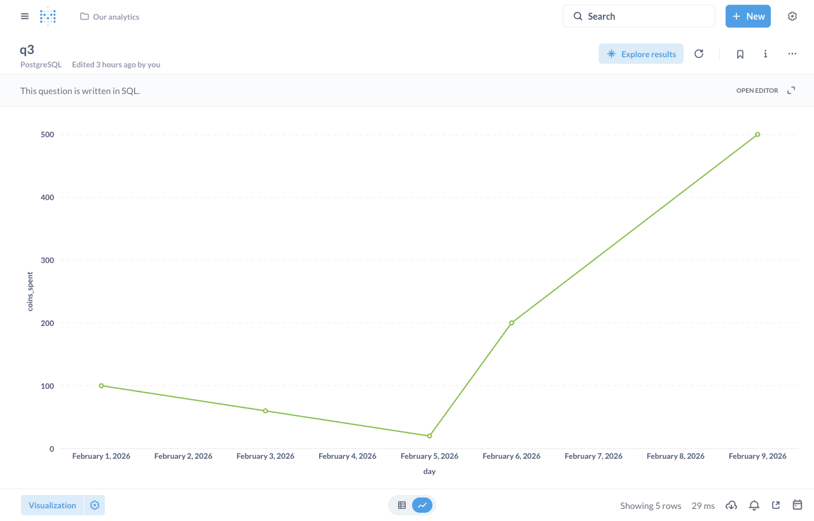
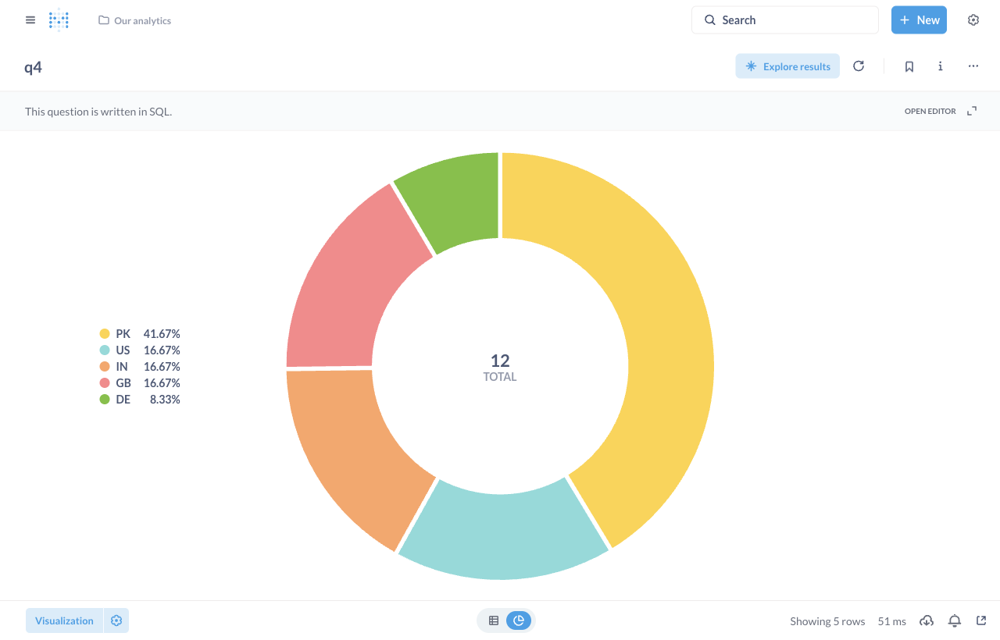
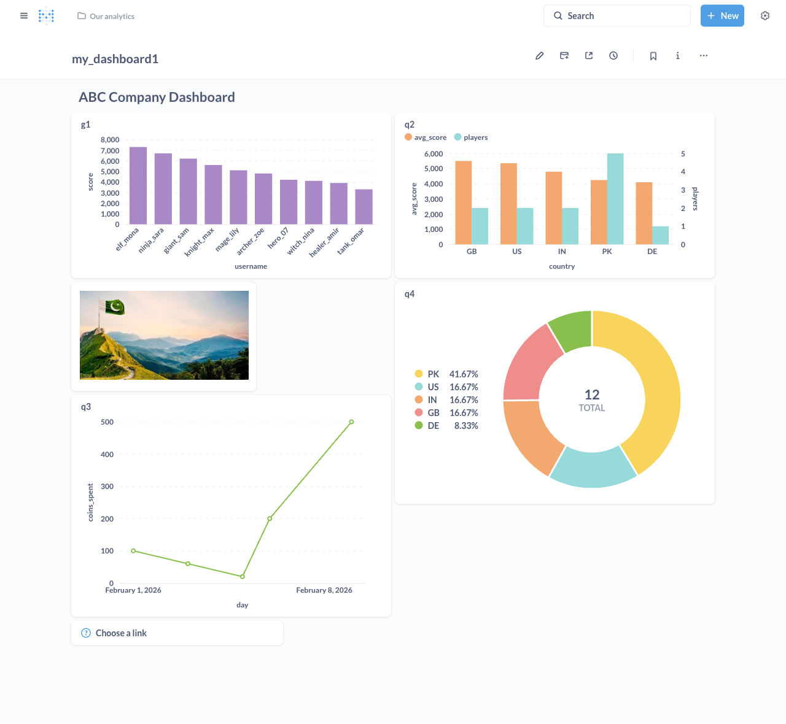

---

## Flow diagrams (Mermaid, render on GitHub)

Complex topics also have a `mermaid` diagram embedded in the lesson:

- **Redux one-way data flow** — [state/01](../state/01-redux-toolkit.md)
- **RTK Query cache & fetch flow** — [state/02](../state/02-rtk-query.md)
- **MSW request interception in tests** — [testing/02](../testing/02-lab-msw.md)
- **One data source → two audiences (app + BI)** — [bi/03](../bi/03-lab-dashboard.md)

---

## Re-capturing

With the stack running (commands at the top), open the lesson's component / page and
overwrite the file under the matching `images/` folder. Metabase login is the admin
account you created on first run; the React app reads the Day 3 API on `:8000`
(CORS must allow `http://localhost:5173`).
