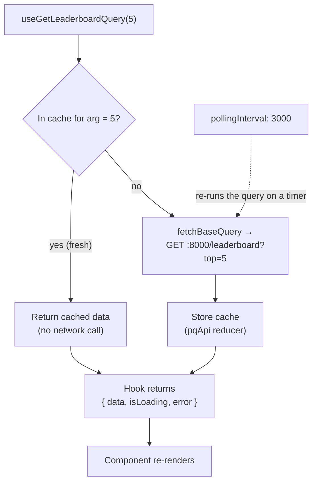

# State — Step 2: RTK Query (data from the API)

## Why RTK Query

In lesson React-3 we fetched data manually: `useState` for the data, `useState` for loading, a `useEffect` to `fetch`, and we'd need more for errors, caching, and refetching. **RTK Query** does all of that for you. You declare your endpoints once, and it gives you a **hook** per endpoint that returns `{ data, isLoading, error }` and caches results automatically.

---

## Define the API once

`src/store/api.ts` — describe the Day 3 endpoints:

```ts
import { createApi, fetchBaseQuery } from "@reduxjs/toolkit/query/react";
import type { Player, LeaderboardRow, PlayerSummary } from "../api/types";

export const pqApi = createApi({
  reducerPath: "pqApi",
  baseQuery: fetchBaseQuery({ baseUrl: "http://localhost:8000" }),
  endpoints: (build) => ({
    getPlayers: build.query<Player[], void>({
      query: () => "/players",
    }),
    getLeaderboard: build.query<LeaderboardRow[], number>({
      query: (top) => `/leaderboard?top=${top}`,
    }),
    getPlayerSummary: build.query<PlayerSummary, number>({
      query: (id) => `/players/${id}/summary`,
    }),
  }),
});

// RTK Query generates a hook per endpoint:
export const { useGetPlayersQuery, useGetLeaderboardQuery, useGetPlayerSummaryQuery } = pqApi;
```

- `build.query<ResultType, ArgType>` types both the response and the argument.
- The generated hooks are named `use<Endpoint>Query`.

## Add it to the store

`src/store/index.ts`:

```ts
import { configureStore } from "@reduxjs/toolkit";
import uiReducer from "./uiSlice";
import { pqApi } from "./api";

export const store = configureStore({
  reducer: {
    ui: uiReducer,
    [pqApi.reducerPath]: pqApi.reducer,
  },
  middleware: (getDefault) => getDefault().concat(pqApi.middleware),
});

export type RootState = ReturnType<typeof store.getState>;
export type AppDispatch = typeof store.dispatch;
```

The `middleware` line enables caching, refetching, and polling.

---

## Use it in a component (this is the payoff)

```tsx
import { useGetLeaderboardQuery } from "../store/api";

export function Leaderboard() {
  const { data, isLoading, error } = useGetLeaderboardQuery(5);

  if (isLoading) return <p>Loading…</p>;
  if (error) return <p>Could not load leaderboard.</p>;

  return (
    <ul>
      {data!.map((r) => <li key={r.player}>{r.rank}. {r.player} — {r.score}</li>)}
    </ul>
  );
}
```

One line — `useGetLeaderboardQuery(5)` — gives you data, loading, and error. No `useEffect`, no manual state. Call the same hook in two components and RTK Query **fetches once and shares the cache**.


*The same five players as the manual-`fetch` version in React-3 — but here a single `useGetLeaderboardQuery(5)` hook handled the request, loading state, and caching.*

### What RTK Query does for you



*The hook reads from the cache first; on a miss it fetches, stores the result, and returns `{ data, isLoading, error }`. A second component calling the same hook reuses the cache instead of fetching again.*

## Near-live updates with polling

Pass `pollingInterval` to refetch on a timer — handy for a leaderboard:

```tsx
const { data } = useGetLeaderboardQuery(5, { pollingInterval: 3000 }); // every 3s
```

---

## Don't forget CORS

This calls `http://localhost:8000` from the browser at `:5173`. If you see a CORS error in the console, add the `CORSMiddleware` snippet from **[../00-setup/README.md](../00-setup/README.md)** to the Day 3 FastAPI app and restart it.

➡️ Next: the lab — **[03-lab-live-data.md](03-lab-live-data.md)**

---

## ⭐ Must-learn from this topic

- **`createApi`** — declare endpoints once; typed `query<Result, Arg>`.
- **Generated hooks** — `useGet…Query` return `{ data, isLoading, error }`.
- **Caching & sharing** — fetch once, reuse across components.
- **`pollingInterval` / `skip`** — near-live updates and conditional fetches.

### 📚 Official docs
- [RTK Query — Overview](https://redux-toolkit.js.org/rtk-query/overview) — why & how.
- [Queries](https://redux-toolkit.js.org/rtk-query/usage/queries) — hooks, polling, skip.
- [fetchBaseQuery](https://redux-toolkit.js.org/rtk-query/api/fetchBaseQuery) — the base fetcher.
