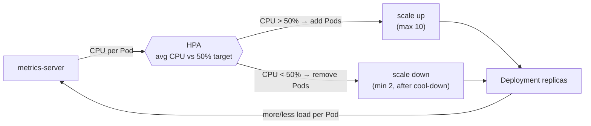

# Autoscaling — Horizontal Pod Autoscaler (HPA)

## The idea

Manual scaling (`kubectl scale`) needs you to watch and react. The **Horizontal Pod Autoscaler (HPA)** does it automatically: it watches a metric (usually **CPU**) and **adds Pods when load rises, removes them when it falls**, between a min and a max you set.

"Horizontal" = more **copies** (Pods). (Vertical = bigger Pods; less common.)

```
 CPU climbs ──► HPA adds Pods (up to maxReplicas)
 CPU falls  ──► HPA removes Pods (down to minReplicas)
```



*A control loop: every ~15s the HPA compares average CPU (from metrics-server) against the 50% target and nudges the Deployment's replica count between `minReplicas` and `maxReplicas`.*

## What it needs (two prerequisites)

1. **metrics-server** — supplies CPU/memory readings. We enabled it in setup:
   ```bash
   minikube addons enable metrics-server
   ```
2. **`resources.requests.cpu`** on the Deployment — the HPA compares real usage against this *request*. Our Deployment requests `cpu: 100m`, so "50% utilization" means 50m of CPU per Pod. Without a request, the HPA has nothing to measure against.

## The HPA manifest

[`code/hpa.yaml`](code/hpa.yaml):

```yaml
apiVersion: autoscaling/v2
kind: HorizontalPodAutoscaler
metadata: { name: pixelquest }
spec:
  scaleTargetRef:
    apiVersion: apps/v1
    kind: Deployment
    name: pixelquest          # the Deployment to scale
  minReplicas: 2
  maxReplicas: 10
  metrics:
    - type: Resource
      resource:
        name: cpu
        target:
          type: Utilization
          averageUtilization: 50   # target: keep average CPU near 50%
```

Plain English: *"keep average CPU around 50%; scale between 2 and 10 Pods to do it."*

## Apply and watch

```bash
# the Deployment must exist (from the k8s lab) and metrics-server enabled
kubectl apply -f day5/autoscale/code/hpa.yaml

kubectl get hpa            # shows current CPU% vs target and current replicas
kubectl get hpa -w         # watch it live
```


*At rest: average CPU is `3%` — well under the `50%` target — so the HPA holds at `minReplicas` (2).*


*Under the k6 load (next section): CPU climbs to `126%`, far above target, so the HPA adds Pods — here `2 → 4 → 6` — and the Service spreads traffic across them.*

At rest, CPU is low and it stays at `minReplicas` (2). When the **k6 load test** (next section) hammers the `/work` endpoint, CPU climbs past 50% and you'll watch the HPA add Pods — up to 10 — then scale back down a few minutes after the load stops.

> Scaling isn't instant: the HPA checks every ~15s and waits a bit before scaling down (a "cool-down") to avoid flapping. So expect a short delay before Pods appear.

This is the **self-managing** part of the day: combined with the k6 test, you'll *see* Kubernetes react to real load.

---

## ⭐ Must-learn from this topic

- **HPA** — auto add/remove Pods based on a metric (usually CPU).
- **Prereqs** — metrics-server + `resources.requests.cpu`.
- **min/max + target** — bounds and the utilization goal.
- **Not instant** — periodic checks + scale-down cool-down.

### 📚 Official docs
- [Horizontal Pod Autoscaling](https://kubernetes.io/docs/tasks/run-application/horizontal-pod-autoscale/) — concepts.
- [HPA walkthrough](https://kubernetes.io/docs/tasks/run-application/horizontal-pod-autoscale-walkthrough/) — a worked example.
- [Resource metrics (metrics-server)](https://kubernetes.io/docs/tasks/debug/debug-cluster/resource-metrics-pipeline/).

➡️ Next: **[../loadtest/01-k6-intro.md](../loadtest/01-k6-intro.md)**
