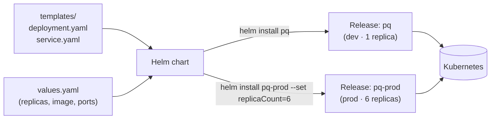

# Helm — Step 1: Why Helm?

## The problem with raw YAML

On Day-5 Kubernetes lessons you applied separate `deployment.yaml` and `service.yaml`, each with hard-coded values (replicas, image tag, ports). For one app that's fine. But:

- Deploying to **dev / staging / prod** means three near-identical copies with a few values changed.
- Bumping the image version means editing several files.
- Sharing an app means handing someone a folder of YAML and hoping they edit the right lines.

**Helm** fixes this. It is the **package manager for Kubernetes**. You bundle your YAML into a **chart** with **templates** + a **values** file, then install it with one command — overriding values per environment.

```
 raw YAML  ──►  Helm chart (templates + values.yaml)  ──►  `helm install` ──► Kubernetes
                                  ▲
                       change values, not templates, per environment
```



*One chart (templates + values) installs as many **releases** as you need — change values per environment instead of editing YAML.*

## The pieces

- **Chart** — a packaged app: a folder with `Chart.yaml`, `values.yaml`, and `templates/`.
- **Template** — a YAML file with `{{ placeholders }}` filled from values.
- **values.yaml** — the default settings (replicas, image, ports). Override at install time.
- **Release** — one installation of a chart into the cluster (you can install the same chart many times under different names).

## Why teams use it

- **One command** to install/upgrade/rollback a whole app (`helm install`, `helm upgrade`, `helm rollback`).
- **One place** for config (`values.yaml`), separate from the templates.
- **Reuse & share** — public charts exist for Postgres, Redis, Grafana, etc.; you `helm install` them instead of writing YAML by hand.

## Helm commands you'll use

```bash
helm install <release> <chart>     # install
helm upgrade <release> <chart>     # apply changes
helm rollback <release> <rev>      # go back
helm uninstall <release>           # remove
helm list                          # what's installed
helm template <chart>              # render templates to YAML (no install) — great for checking
```

Next we look at the chart we built for Pixel Quest.

➡️ Next: **[02-chart-anatomy.md](02-chart-anatomy.md)**

---

## ⭐ Must-learn from this topic

- **Helm = k8s package manager** — bundle YAML into a chart.
- **Chart / template / values / release** — the four words.
- **One command** — install/upgrade/rollback a whole app.
- **Values per environment** — change settings, not templates.

### 📚 Official docs
- [Helm — Quickstart](https://helm.sh/docs/intro/quickstart/) — install & first chart.
- [Using Helm](https://helm.sh/docs/intro/using_helm/) — the commands.
- [Artifact Hub](https://artifacthub.io/) — ready-made public charts.
