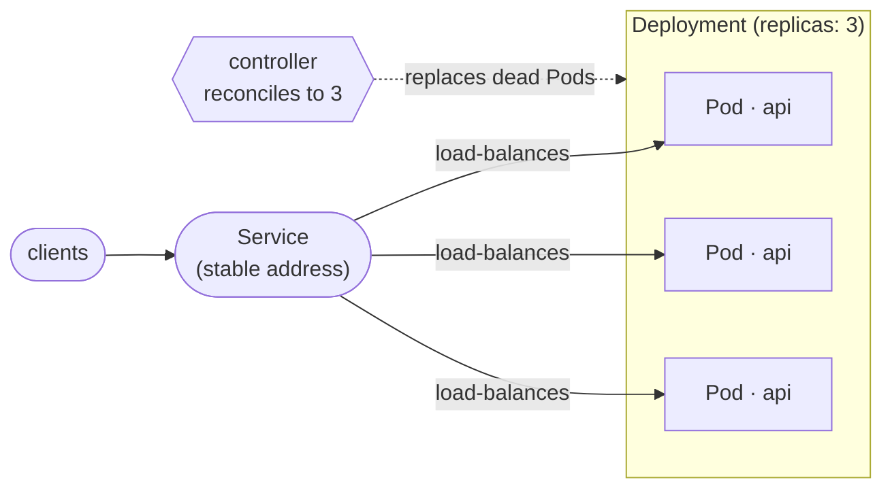

# Kubernetes — Step 1: What it is, and the core ideas

## What is Kubernetes?

**Kubernetes** (often written **k8s**) is a system that runs your containers across a cluster of machines and keeps them healthy: it starts the right number of copies, restarts crashed ones, spreads traffic across them, and scales up under load. You describe the **desired state** in YAML; Kubernetes makes reality match it.

We run a one-node cluster on the laptop with **minikube**, and control it with **kubectl**.

We use Kubernetes when an app needs to be **always-on, scalable, and self-healing** — not just one process on one machine.

## The words you must know

Learn these and the YAML stops being scary.

- **Container / image** — your app packaged with its dependencies (we build one with Docker).
- **Pod** — the smallest unit Kubernetes runs: one (or a few) containers together. Pods are disposable — they come and go.
- **Deployment** — says "keep N copies (**replicas**) of this Pod running". Handles restarts and rolling updates.
- **Service** — one **stable address** in front of the Pods that **load-balances** across them (Pods change IPs; the Service doesn't).
- **ConfigMap / Secret** — configuration and secrets injected into Pods (so config isn't baked into the image).
- **kubectl** — the command-line tool you use to apply YAML and inspect everything.

Picture it:

```
 Deployment (replicas: 3)
   ├─ Pod  [api container]   ◄─┐
   ├─ Pod  [api container]   ◄─┤  Service (stable address) ── load-balances ──► clients
   └─ Pod  [api container]   ◄─┘
```



*The **Deployment** keeps 3 Pods alive (a controller reconciles if one dies); the **Service** is the one stable address that load-balances across them.*

## Desired state, not steps

The big idea: you don't tell Kubernetes *how* to start things step by step. You declare *what you want* ("3 replicas of this image, exposed on port 80") in YAML and `kubectl apply` it. A controller constantly checks and **reconciles** — if a Pod dies, it makes a new one to get back to 3. This is why k8s apps self-heal.

## kubectl basics

```bash
kubectl get nodes            # the machines in the cluster
kubectl get pods             # running pods
kubectl get all              # pods, services, deployments at once
kubectl apply -f file.yaml   # create/update from a manifest
kubectl describe pod <name>  # detailed status & events (great for debugging)
kubectl logs <name>          # a pod's logs
kubectl delete -f file.yaml  # remove what the manifest created
```

## What we will build today

We containerize the small stateless Pixel Quest API, deploy it with a **Deployment** (multiple replicas), expose it with a **Service**, scale it, then let an autoscaler and a k6 load test push it. Everything is declared in YAML you can read and re-apply.

➡️ Next: **[02-containerize-the-app.md](02-containerize-the-app.md)**

---

## ⭐ Must-learn from this topic

- **Core objects** — container/image, Pod, Deployment, Service, ConfigMap/Secret.
- **Desired state** — declare YAML; controllers reconcile (self-healing).
- **Service in front of Pods** — stable address + load balancing.
- **kubectl** — `get`, `apply`, `describe`, `logs`, `delete`.

### 📚 Official docs
- [Kubernetes concepts](https://kubernetes.io/docs/concepts/) — the model.
- [kubectl cheatsheet](https://kubernetes.io/docs/reference/kubectl/cheatsheet/) — everyday commands.
- [minikube — start](https://minikube.sigs.k8s.io/docs/start/) — the local cluster.
