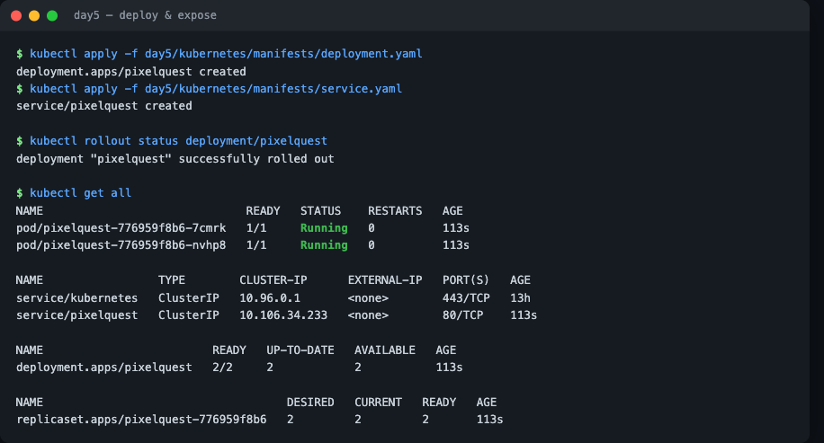
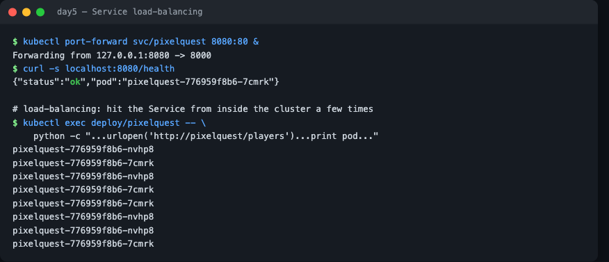

# Kubernetes — Step 3: Deployments and Services

Two manifests run our API and expose it: a **Deployment** (the Pods) and a **Service** (the stable front door).

---

## The Deployment

[`manifests/deployment.yaml`](manifests/deployment.yaml) — the important parts:

```yaml
apiVersion: apps/v1
kind: Deployment
metadata:
  name: pixelquest
spec:
  replicas: 2                       # keep 2 copies running
  selector:
    matchLabels: { app: pixelquest }
  template:                         # the Pod blueprint
    metadata:
      labels: { app: pixelquest }
    spec:
      containers:
        - name: api
          image: pixelquest-api:1.0
          imagePullPolicy: IfNotPresent
          ports: [{ containerPort: 8000 }]
          resources:
            requests: { cpu: "100m", memory: "128Mi" }   # what it needs
            limits:   { cpu: "250m", memory: "256Mi" }   # the ceiling
          readinessProbe: { httpGet: { path: /health, port: 8000 } }
          livenessProbe:  { httpGet: { path: /health, port: 8000 } }
```

- **`replicas: 2`** — Kubernetes keeps exactly 2 Pods alive (restarts any that die).
- **`labels` + `selector`** — the Deployment owns Pods labelled `app: pixelquest`; the Service finds them the same way.
- **`resources.requests`** — how much CPU/memory the Pod needs. The autoscaler later compares real usage against this **request** to decide when to add Pods, so it's required for autoscaling.
- **Probes** — `readinessProbe` gates traffic until `/health` passes; `livenessProbe` restarts a stuck container. This is how k8s self-heals.

## The Service

[`manifests/service.yaml`](manifests/service.yaml):

```yaml
apiVersion: v1
kind: Service
metadata: { name: pixelquest }
spec:
  type: ClusterIP
  selector: { app: pixelquest }     # route to those Pods
  ports:
    - port: 80                       # the Service port
      targetPort: 8000               # the container port
```

The Service gives the group of Pods **one stable name/address** (`pixelquest`) and **load-balances** requests across them. Pods can be replaced freely; clients always talk to the Service.

---

## Apply them

```bash
kubectl apply -f day5/kubernetes/manifests/deployment.yaml
kubectl apply -f day5/kubernetes/manifests/service.yaml

kubectl get pods         # two pixelquest pods, should become Running/Ready
kubectl get svc          # the pixelquest service
```



*`kubectl get all` after applying both manifests: the Deployment with 2/2 ready Pods, the ReplicaSet it created, and the `pixelquest` Service in front.*

## Reach the API

`ClusterIP` services are internal, so port-forward to your laptop:

```bash
kubectl port-forward svc/pixelquest 8080:80
# in another terminal:
curl localhost:8080/players
```

Call `/players` a few times — the `pod` field in the response changes, showing the Service **load-balancing** across the two replicas.



*`kubectl port-forward` reaches the API for `/health`. To *see* the load-balancing, hit the Service from inside the cluster a few times — the `pod` field alternates between the two replicas. (A single `port-forward` connection pins to one Pod, so the round-robin shows best from in-cluster or under many connections.)*

➡️ Next: **[04-config-and-scaling.md](04-config-and-scaling.md)**

---

## ⭐ Must-learn from this topic

- **Deployment** — `replicas`, the Pod `template`, labels & selector.
- **`resources.requests`** — required for autoscaling decisions.
- **Probes** — readiness gates traffic; liveness restarts stuck containers.
- **Service** — stable address + load balancing; `port` vs `targetPort`.

### 📚 Official docs
- [Deployments](https://kubernetes.io/docs/concepts/workloads/controllers/deployment/) — running replicas.
- [Services](https://kubernetes.io/docs/concepts/services-networking/service/) — exposing Pods.
- [Liveness/readiness probes](https://kubernetes.io/docs/tasks/configure-pod-container/configure-liveness-readiness-startup-probes/).
