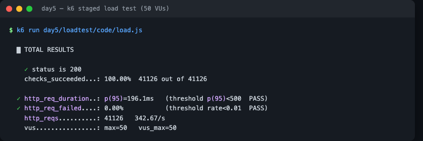

# Load Testing — Step 2: Writing tests, stages, and thresholds

A real load test does two things the smoke test didn't: **ramp the load over time** (stages) and **define pass/fail rules** (thresholds). File: [`code/load.js`](code/load.js).

---

## Stages — ramp up, hold, ramp down

Instead of a flat number of VUs, `stages` change the VU count over time:

```js
export const options = {
  stages: [
    { duration: "30s", target: 50 },   // ramp 0 -> 50 VUs
    { duration: "1m",  target: 50 },   // hold at 50
    { duration: "30s", target: 0 },    // ramp 50 -> 0
  ],
};
```

This models real traffic: a rise, a sustained peak, a fall. k6 interpolates between targets, so the first stage smoothly climbs to 50 VUs.

## Thresholds — make the test pass or fail

**Thresholds** turn metrics into pass/fail criteria. If any threshold is breached, k6 exits with an error code — so a CI pipeline can **fail the build** on a performance regression.

```js
export const options = {
  thresholds: {
    http_req_duration: ["p(95)<500"],   // 95th percentile latency under 500ms
    http_req_failed: ["rate<0.01"],     // error rate under 1%
  },
};
```

- `p(95)<500` — 95% of requests must finish under 500 ms (p95 is the standard latency SLO; ignore the slowest 5% outliers).
- `rate<0.01` — fewer than 1% of requests may fail.

## The work the VUs do

We hit `/work?n=20000` so each request burns a little CPU — that's what makes the cluster's CPU rise and the **HPA** add Pods:

```js
export default function () {
  const res = http.get(`${BASE}/work?n=20000`);
  check(res, { "status is 200": (r) => r.status === 200 });
}
```

## Run the staged test

```bash
kubectl port-forward svc/pixelquest 8080:80      # terminal 1
k6 run day5/loadtest/code/load.js                # terminal 2
```

At the end, k6 prints whether each **threshold** passed (✓/✗) plus the metrics. Watch the HPA in a third terminal:

```bash
kubectl get hpa -w
```

As the 50 VUs hold, CPU rises and you should see the HPA bump replicas above 2.



*The staged 50-VU run: **~343 req/s**, **41,126 requests**, **0% errors**, and **p(95) = 196ms** — both thresholds pass. Meanwhile the `/work` CPU burn pushed average CPU to 126%, so the HPA scaled the Deployment from 2 to 6 Pods.*

## Reading the key metrics

- **`http_req_duration`** — `avg`, `p(95)`, `max`. Latency. p95 is what you report.
- **`http_reqs`** — total and **per second** (your throughput / RPS).
- **`http_req_failed`** — error rate.
- **`vus` / `vus_max`** — how many virtual users were active.

➡️ Next: the lab — **[03-lab-5k-load.md](03-lab-5k-load.md)**

---

## ⭐ Must-learn from this topic

- **Stages** — ramp VUs up / hold / down to model real traffic.
- **Thresholds** — pass/fail rules (`p(95)<500`, `rate<0.01`); fail CI on regressions.
- **Key metrics** — `http_req_duration` (p95), `http_reqs` (RPS), `http_req_failed`.
- **Drive CPU** — hit `/work` so the HPA reacts.

### 📚 Official docs
- [Test lifecycle & options](https://grafana.com/docs/k6/latest/using-k6/k6-options/reference/) — stages, VUs.
- [Thresholds](https://grafana.com/docs/k6/latest/using-k6/thresholds/) — pass/fail criteria.
- [Metrics](https://grafana.com/docs/k6/latest/using-k6/metrics/) — what k6 reports.
