# Day 5 screenshots — what's captured and where

Every Day 5 example has a screenshot embedded in its lesson, right after the
matching command. Day 5 is CLI-driven, so these are styled renders of **real**
terminal output captured against a live minikube cluster. Images live in a
per-topic `images/` folder next to the lessons; this page gathers them all.

Captured against:

```bash
minikube start && minikube addons enable metrics-server
minikube image build -t pixelquest-api:1.0 day5/kubernetes/app
kubectl apply -f day5/kubernetes/manifests/    # Deployment + Service
kubectl apply -f day5/autoscale/code/hpa.yaml  # HPA (min 2, max 10, 50% CPU)
```

---

## 0. Setup — [`00-setup/images/`](../00-setup/images/)

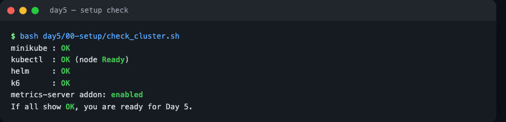

## 1. Kubernetes — [`kubernetes/images/`](../kubernetes/images/)

| Lesson | Shot |
|--------|------|
| [01 — concepts](../kubernetes/01-intro-and-concepts.md) | **Deployment → Service diagram** |
| [02 — containerize](../kubernetes/02-containerize-the-app.md) | `minikube image build` + `image ls` |
| [03 — deploy & expose](../kubernetes/03-deployments-and-services.md) | `kubectl get all`; Service load-balancing |
| [04 — config & scaling](../kubernetes/04-config-and-scaling.md) | ConfigMap + scale to 5 |
| [05 — LAB](../kubernetes/05-lab-deploy-pixelquest.md) | self-healing (delete a Pod) |

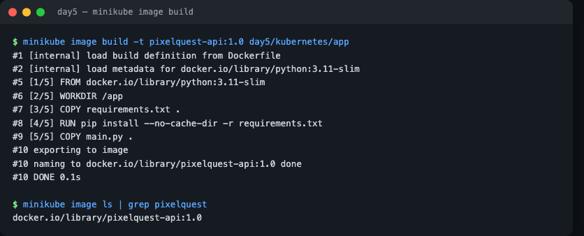


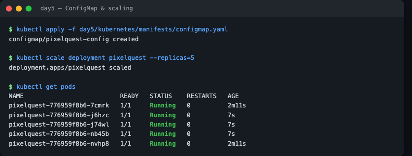
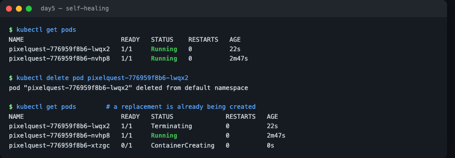

## 2. Helm — [`helm/images/`](../helm/images/)

| Lesson | Shot |
|--------|------|
| [01 — why Helm](../helm/01-why-helm.md) | **chart → releases diagram** |
| [02 — chart anatomy](../helm/02-chart-anatomy.md) | `helm template` rendered YAML |
| [03 — LAB](../helm/03-lab-package-and-install.md) | install/list/get all; upgrade/history/rollback |

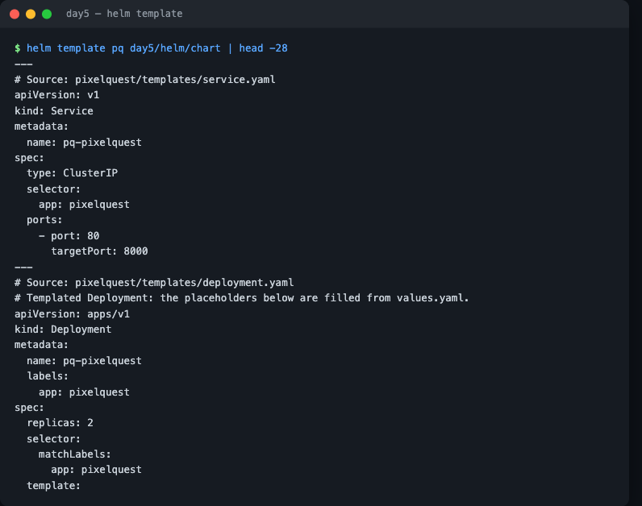
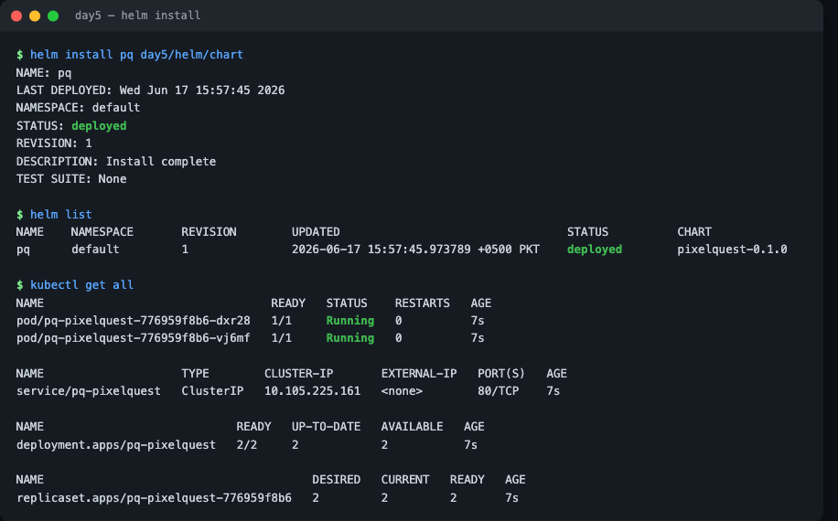
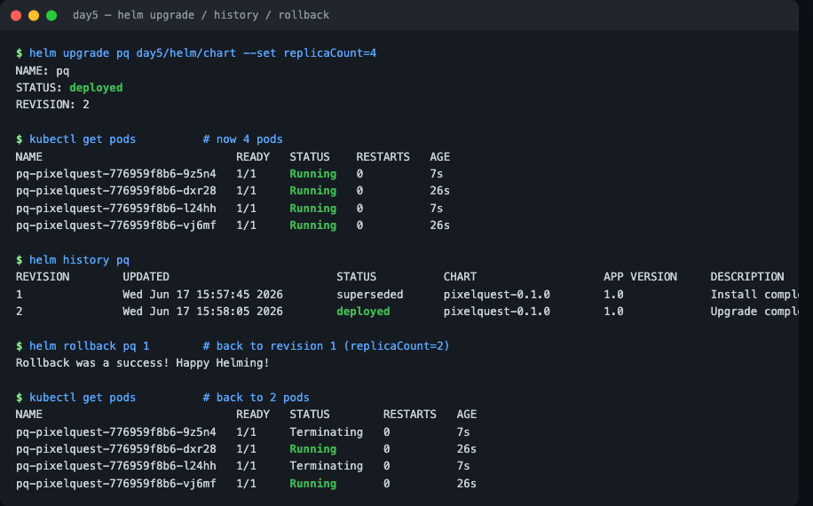

## 3. Autoscaling — [`autoscale/images/`](../autoscale/images/)

| Lesson | Shot |
|--------|------|
| [01 — HPA](../autoscale/01-hpa.md) | **HPA control-loop diagram**; HPA at rest and under load |

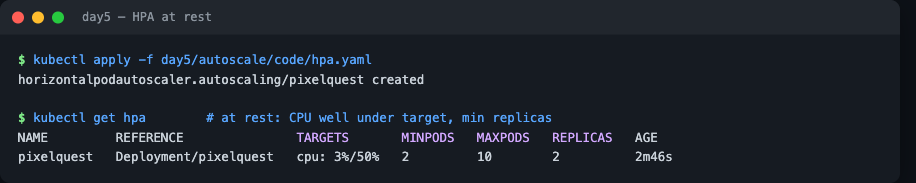
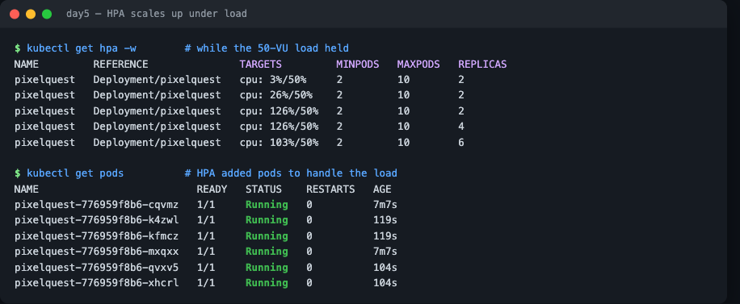

## 4. Load testing (k6) — [`loadtest/images/`](../loadtest/images/)

| Lesson | Shot |
|--------|------|
| [01 — intro](../loadtest/01-k6-intro.md) | smoke test (p95 ~12ms) |
| [02 — tests & thresholds](../loadtest/02-writing-tests.md) | staged 50-VU load (343 rps, 0 errors, → 6 pods) |
| [03 — LAB 5k](../loadtest/03-lab-5k-load.md) | HPA scales to 10; k6 5k summary |

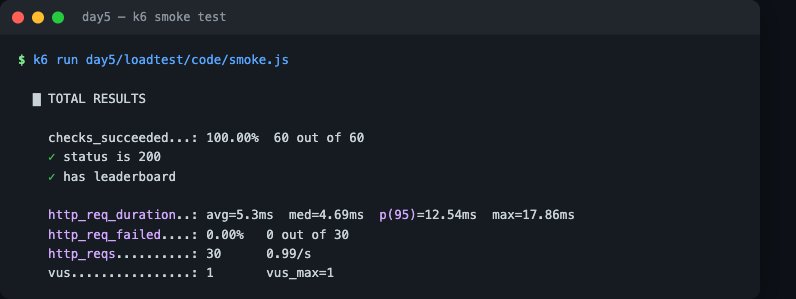

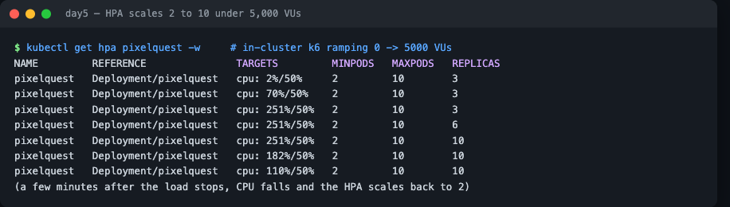
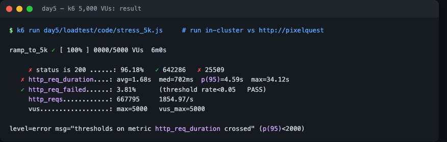

---

## Flow diagrams (Mermaid, render on GitHub)

- **Deployment → Pods → Service** — [kubernetes/01](../kubernetes/01-intro-and-concepts.md)
- **One chart → many releases** — [helm/01](../helm/01-why-helm.md)
- **HPA control loop** — [autoscale/01](../autoscale/01-hpa.md)

---

## What the 5k test showed (a real finding)

On a one-node minikube the HPA scaled the API to **maxReplicas (10)** and served
**~1,855 req/s** across **667k requests** with a **3.81% error rate** (under the 5%
threshold). But **p95 latency hit 4.59s**, breaching the 2s SLO — the single node ran
out of CPU at peak. To go further you'd raise `maxReplicas`, add nodes, give Pods more
CPU, or optimize the endpoint.

> **Driving 5,000 VUs:** `kubectl port-forward` can't sustain that load (it's a single
> proxied connection and dies). Run k6 **inside the cluster** against the Service
> (`BASE_URL=http://pixelquest`) for the big run; port-forward is fine for smoke/50-VU.

## Re-capturing

Bring the cluster up (commands at the top), run the lesson's command, and render the
output. The terminal styling is cosmetic — the numbers are real.
